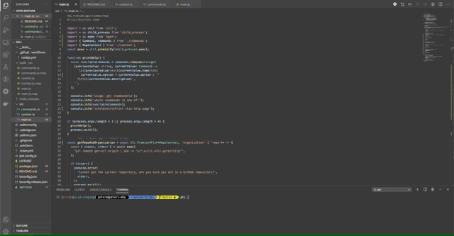

# GitHub Jump

Glorified Bash script that detects the current organization/user and branch and quickly jumps to relevant pages on GitHub using the CLI.
The default browser is used to open the relevant pages. So no security tokens required for the script to work.

<p align="center">
  
</p>

## Install

```
npm install ghj -g
```

## Usage

```
usage: ghj <command>

where <command> is one of:

        issue   repo            Open a new pull request for a the current repo or target <repo>
        pr      branch          Open a new pull request in the current repo against master or target <branch>
        board                   Open the project board for the organization
        help                    Print this help page
```
